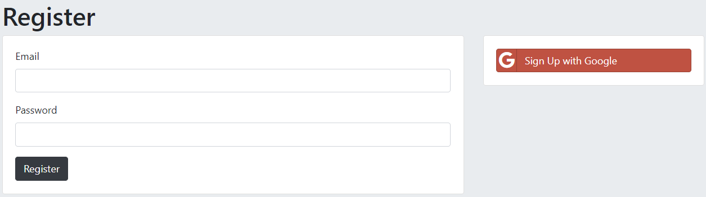
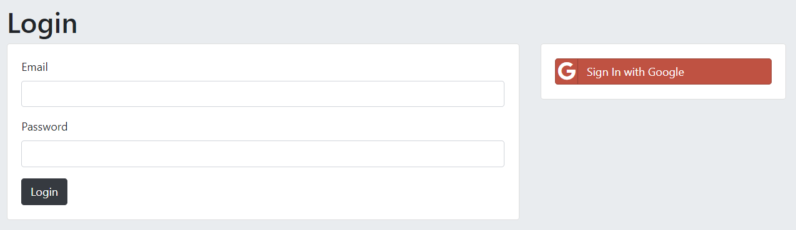
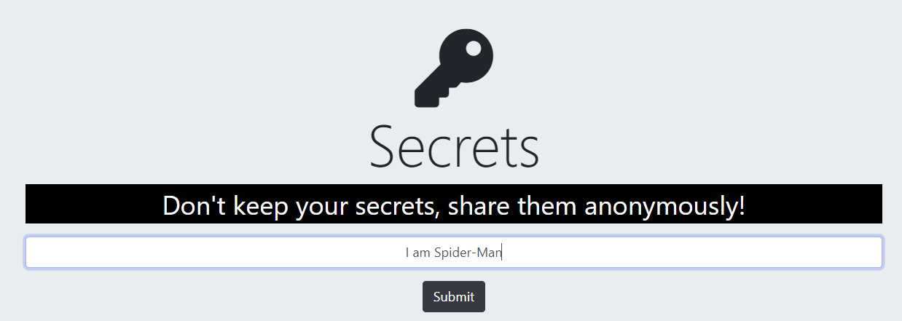

# Auth-Security-Application
A full stack web application I developed while following along my [Web Development Bootcamp](https://www.udemy.com/certificate/UC-f9575c1c-2918-40f8-a711-fd0110429b54/) on Udemy to explore a variety of security methods concerning authentication. 

The application is minimal version of the app [Whisper](http://whisper.sh/), where users can create an account, & publish one of their secrets anonymously for others to view. 

### The final solution was to:
- Allow the user to sign in with Google
- Or to create an account where we hash the password using bcrypt & add multiple salt rounds.

## Multiple levels of security were explored including:
- **Level 1:** Storing password in [mongoDB](https://www.mongodb.com/)
- **Level 2:** Encrypting the user's password using [mongoo-encryption](https://www.npmjs.com/package/mongoose-encryption)
  - _commit:_ [f0f521e](https://github.com/CarterMacLennan/Auth-Security-Application/commit/f0f521e4d07741f261d98072f0fd70b83ff27094)
- **Level 3:** Hashing the password with [md5](https://www.npmjs.com/package/md5)
  - _commit:_ [4b03d7f](https://github.com/CarterMacLennan/Auth-Security-Application/commit/4b03d7f5dea1a1b86f63d9378b85a3c856fad926)
- **Level 4:** Upgrading hashing to [bcrypt with salt rounds](https://www.npmjs.com/package/bcrypt)
  - _commit:_ [7c7d00d](https://github.com/CarterMacLennan/Auth-Security-Application/commit/7c7d00d254603f7ca3f49bcc0f7b264f7ccae2da)
- **Level 5:** Using [Passport.js](http://www.passportjs.org/) to implement sign in with Google
  - _commit:_ [b8b69aa](https://github.com/CarterMacLennan/Auth-Security-Application/commit/b8b69aa92367d3d501a08833370adc111f724639)
  
 ## Software Stack: 
* [MongoDB](https://www.mongodb.com/) - Used to store articles as JSON-like documents in a NoSQL database 
* [Mongoose](https://mongoosejs.com/) - An ODM used to provide structure to the data I wished to store in MongoDB
* [Node.js](https://nodejs.dev/) - Used as a runtime environment for JS & install third-party packages with npm
* [Express.js](https://expressjs.com/) - Used to perform a series of middleware function calls, and run the node server 
* [EJS](https://ejs.co/) - Used as our server's view engine

### TOOLS
- [Robo 3T](https://robomongo.org/) - GUI for mongoDB, helped with testing
- [Postman](https://www.postman.com/) - Used for testing requests againts our API server 

### Screenshots:

